# Password Reset Data Flow

This document explains the complete data flow for the "Forgot Password" and "Reset Password" features in LocalMind.

---

## Architecture Overview Diagram

```mermaid
flowchart TB
    subgraph Frontend["🖥️ Frontend (React)"]
        FP_UI["ForgotPassword.tsx<br/>Email Form"]
        RP_UI["ResetPassword.tsx<br/>New Password Form"]
        SERVICE["auth.service.ts<br/>API Client"]
    end

    subgraph Backend["⚙️ Backend (Express)"]
        ROUTE["user.routes.ts<br/>/auth endpoints"]
        CONTROLLER["user.controller.ts<br/>forgot/reset handlers"]
        SERVICE_BE["user.service.ts<br/>Business Logic"]
        MAIL["email.ts<br/>Nodemailer"]
    end

    subgraph Database["🗄️ MongoDB"]
        USER_COLL[(User Collection)]
    end

    %% Forgot Password Flow
    FP_UI -->|"1. Submit Email"| SERVICE
    SERVICE -->|"2. POST /auth/forgot-password"| ROUTE
    ROUTE -->|"3. forgotPassword()"| CONTROLLER
    CONTROLLER -->|"4. Generate & Save Token"| SERVICE_BE
    SERVICE_BE -->|"5. Hash Token & Save"| USER_COLL
    SERVICE_BE -->|"6. Send Email (Raw Token)"| MAIL
    MAIL -.->|"7. Email with Link".| User

    %% Reset Password Flow
    User -.->|"8. Click Link /reset-password/:token".| RP_UI
    RP_UI -->|"9. Submit New Password"| SERVICE
    SERVICE -->|"10. POST /auth/reset-password/:token"| ROUTE
    ROUTE -->|"11. resetPassword()"| CONTROLLER
    CONTROLLER -->|"12. Verify & Update"| SERVICE_BE
    SERVICE_BE -->|"13. Find by Hashed Token"| USER_COLL
    SERVICE_BE -->|"14. Allow & Update Password"| USER_COLL
```

---

## Process Flow Explained

### Phase 1: Requesting a Reset Link (Forgot Password)

1.  **User Action**: User enters their email in `ForgotPassword.tsx` and clicks "Send Reset Link".
2.  **API Call**: Frontend calls `forgotPassword(email)` in `auth.service.ts`.
3.  **Endpoint**: `POST /api/v1/user/auth/forgot-password`
4.  **Backend Logic** (`user.service.ts`):
    - **Find User**: Checks if a user with that email exists.
    - **Generate Token**: Creates a random 32-byte hex string (`token`).
    - **Hash Token**: Creates a simple `sha256` hash of that token.
    - **Save to DB**: Updates the user document with:
      - `resetPasswordToken`: The **hashed** version.
      - `resetPasswordExpire`: Expiration time (10 minutes).
    - **Send Email**: Sends an email containing the **raw** (unhashed) token in the link:
      `http://localhost:5173/reset-password/${resetToken}`

> **Security Note**: We store the _hash_ in the DB but send the _raw_ token to the user. This ensures that if the DB is compromised, the attacker cannot generate valid reset links.

### Phase 2: Resetting the Password

1.  **User Action**: User clicks the link in their email.
2.  **Frontend Route**: Opens `ResetPassword.tsx`. The `token` is extracted from the URL (`useParams`).
3.  **User Input**: User enters and confirms their new password.
4.  **API Call**: Frontend calls `resetPassword(token, password)` in `auth.service.ts`.
5.  **Endpoint**: `POST /api/v1/user/auth/reset-password/:token`
6.  **Backend Logic** (`user.service.ts`):
    - **Hash Input Token**: Hashes the `token` received from the URL using `sha256`.
    - **Verify**: Searches the database for a user where:
      - `resetPasswordToken` matches the hashed token.
      - `resetPasswordExpire` is greater than `Date.now()` (not expired).
    - **Update**:
      - Hashes the _new_ password.
      - Updates `password` field.
      - Sets `resetPasswordToken` and `resetPasswordExpire` to `null` (consumes the token).
7.  **Response**: Returns success, and frontend redirects user to Login.

---

## 🔑 Key Security Features

- **Token Hashing**: The reset token is never stored in plain text in the database.
- **Expiration**: Tokens are valid for only 10 minutes.
- **Enumeration Protection**: The "Forgot Password" endpoint always returns "success" (200 OK) even if the email doesn't exist, preventing attackers from checking which emails are registered.
