# SignUp Data Flow Explained

This document explains the complete data flow of the SignUp feature in LocalMind, from user input to database storage.

---

## Architecture Overview Diagram

```mermaid
flowchart TB
    subgraph Frontend["🖥️ Frontend (React)"]
        UI["SignUp.tsx<br/>User Interface"]
        ZOD["Zod Schema<br/>Client Validation"]
        PAYLOAD["SignUpPayload<br/>Type Definition"]
        SERVICE["auth.service.ts<br/>API Client"]
    end

    subgraph Backend["⚙️ Backend (Express)"]
        ROUTE["user.routes.ts<br/>/api/v1/user/register"]
        CONTROLLER["user.controller.ts<br/>register()"]
        VALIDATOR["user.validator.ts<br/>Server Validation"]
        USERSERVICE["user.service.ts<br/>createUser()"]
        UTILS["user.utils.ts<br/>Password Hashing"]
    end

    subgraph Database["🗄️ MongoDB"]
        MODEL["user.model.ts<br/>Mongoose Schema"]
        DB[(User Collection)]
    end

    UI -->|"1. Form Submit"| ZOD
    ZOD -->|"2. Valid Data"| PAYLOAD
    PAYLOAD -->|"3. POST Request"| SERVICE
    SERVICE -->|"4. HTTP POST"| ROUTE
    ROUTE -->|"5. Route Handler"| CONTROLLER
    CONTROLLER -->|"6. Validate"| VALIDATOR
    VALIDATOR -->|"7. Valid"| USERSERVICE
    USERSERVICE -->|"8. Hash Password"| UTILS
    UTILS -->|"9. Create User"| MODEL
    MODEL -->|"10. Save"| DB
    DB -->|"11. User Doc"| MODEL
    MODEL -->|"12. Response"| CONTROLLER
    CONTROLLER -->|"13. JWT + Response"| SERVICE
    SERVICE -->|"14. Redirect"| UI
```



---

## Step-by-Step Data Flow

### 1️⃣ User Input (Frontend)

**File:** [SignUp.tsx](file:///b:/Open_Source/LocalMind/LocalMind/LocalMind-Frontend/src/features/Auth/SignUp.tsx)

User fills in the form fields stored in React state:

```typescript
const [formData, setFormData] = useState<FormData>({
  firstName: '',
  email: '',
  password: '',
  confirmPassword: '', // ← Frontend only, NOT sent to backend
  birthPlace: '',
  location: '',
  portfolioUrl: '',
  bio: '',
})
```

---

### 2️⃣ Client-Side Validation (Zod)

**File:** [SignUp.tsx#L10-L24](file:///b:/Open_Source/LocalMind/LocalMind/LocalMind-Frontend/src/features/Auth/SignUp.tsx#L10-L24)

Before sending to the API, data is validated using Zod:

```typescript
const signUpSchema = z
  .object({
    firstName: z.string().min(1, 'First name is required'),
    email: z.string().email('Please enter a valid email address'),
    password: z
      .string()
      .min(8, 'Password must be at least 8 characters')
      .max(128, 'Password must be less than 128 characters')
      .regex(/[A-Z]/, 'Password must contain at least one uppercase letter')
      .regex(/[a-z]/, 'Password must contain at least one lowercase letter')
      .regex(/[0-9]/, 'Password must contain at least one number')
      .regex(/[@$!%*?&]/, 'Password must contain at least one special character'),
    confirmPassword: z.string(),
    // ...
  })
  .refine(data => data.password === data.confirmPassword, {
    message: 'Passwords do not match',
    path: ['confirmPassword'],
  })
```

> [!NOTE] > `confirmPassword` is validated on the frontend but **never sent to the backend**. It's stripped out when preparing the payload.

---

### 3️⃣ Payload Preparation

**File:** [SignUp.tsx#L71-L81](file:///b:/Open_Source/LocalMind/LocalMind/LocalMind-Frontend/src/features/Auth/SignUp.tsx#L71-L81)

The form data is transformed into the API payload (excluding `confirmPassword`):

```typescript
const payload: SignUpPayload = {
  firstName: formData.firstName,
  email: formData.email,
  password: formData.password, // ← Plain text (HTTPS encrypted)
  birthPlace: formData.birthPlace,
  location: formData.location,
  portfolioUrl: formData.portfolioUrl,
  bio: formData.bio,
  role: 'user', // ← Hardcoded as 'user'
}
```

---

### 4️⃣ API Service Call

**File:** [auth.service.ts](file:///b:/Open_Source/LocalMind/LocalMind/LocalMind-Frontend/src/services/auth.service.ts)

The service sends a POST request using Axios:

```typescript
export async function registerUser(data: SignUpPayload): Promise<AuthResponse> {
  const response = await authApi.post<AuthResponse>(
    API_ENDPOINTS.AUTH.REGISTER, // → http://localhost:5000/api/v1/user/auth/signup
    data
  )
  return response.data
}
```

---

### 5️⃣ Backend Route Handler

**File:** [user.routes.ts](file:///b:/Open_Source/LocalMind/LocalMind/LocalMind-Backend/src/api/v1/user/user.routes.ts)

The route maps the URL to the controller:

```
POST /api/v1/auth/signup → userController.register
```

---

### 6️⃣ Server-Side Validation

**File:** [user.validator.ts](file:///b:/Open_Source/LocalMind/LocalMind/LocalMind-Backend/src/api/v1/user/user.validator.ts)

Backend validates with **stricter rules**:

```typescript
export const userRegisterSchema = z
  .object({
    firstName: z.string().trim().min(1), // ✅ Now matches frontend
    email: z.string().email().toLowerCase(),
    password: passwordSchema, // Requires uppercase, lowercase, number, special char
    birthPlace: z.string().trim().min(1),
    location: z.string().trim().min(1),
    portfolioUrl: z.string().url().optional(),
    bio: z.string().max(50).optional(),
    role: z.enum(['user', 'admin']).default('user'),
  })
  .strict()
```

> [!TIP]
> Frontend and backend validation rules are now **aligned**. Password requirements match exactly.

---

### 7️⃣ Controller Logic

**File:** [user.controller.ts#L29-L70](file:///b:/Open_Source/LocalMind/LocalMind/LocalMind-Backend/src/api/v1/user/user.controller.ts#L29-L70)

The controller orchestrates the registration:

```typescript
async register(req: Request, res: Response) {
  // 1. Validate request body
  const validatedData = await userRegisterSchema.parseAsync(req.body)

  // 2. Check if email already exists
  const existingUser = await UserUtils.findUserByEmail(validatedData.email)
  if (existingUser) throw new Error('Email already exists')

  // 3. Create user (password is hashed in service)
  const user = await userService.createUser(validatedData)

  // 4. Generate JWT token
  const token = UserUtils.generateToken({ userId, email, role })

  // 5. Set token in response header/cookie
  this.setHeaderToken(res, token)

  // 6. Send success response
  SendResponse.success(res, 'User created successfully', { userObj }, 201)
}
```

---

### 8️⃣ User Service - Password Hashing

**File:** [user.service.ts](file:///b:/Open_Source/LocalMind/LocalMind/LocalMind-Backend/src/api/v1/user/user.service.ts)

Password is hashed before storage:

```typescript
async createUser(data: IUser) {
  const hashPassword = await UserUtils.passwordHash(String(data.password))

  const user = await User.create({
    ...data,
    password: hashPassword,  // ← bcrypt hashed password
    role: data.role || 'user',
    portfolioUrl: data.portfolioUrl ?? null,
    bio: data.bio ?? null,
  })
  return user
}
```

---

### 9️⃣ Database Storage

**File:** [user.model.ts](file:///b:/Open_Source/LocalMind/LocalMind/LocalMind-Backend/src/api/v1/user/user.model.ts)

Data is saved to MongoDB with this schema:

```typescript
const userSchema = new Schema<IUser>(
  {
    firstName: { type: String, required: true },
    email: { type: String, required: true, unique: true },
    password: { type: String, required: true, select: false }, // Never returned in queries
    role: { type: String, enum: ['user', 'admin'], default: 'user' },
    birthPlace: { type: String, required: true },
    location: { type: String, required: true },
    portfolioUrl: { type: String, default: null },
    bio: { type: String, default: null },
    apikey: { type: String, default: null },
  },
  { timestamps: true }
) // Adds createdAt, updatedAt
```

---

### 🔟 Response Flow

After successful registration:

1.  **Backend** returns `201 Created` with user object + JWT token
2.  **Frontend** catches success and redirects to `/login`
3.  **User** sees success message: _"Registration successful! Please log in."_

---

## Data Transformation Summary

| Stage                 | Data Shape                           | Key Changes                       |
| --------------------- | ------------------------------------ | --------------------------------- |
| **Form State**        | 8 fields including `confirmPassword` | User input (raw)                  |
| **Zod Validation**    | Same 8 fields                        | Validated, passwords matched      |
| **API Payload**       | 7 fields (no `confirmPassword`)      | `role: 'user'` added              |
| **Server Validation** | Validates `firstName`                | ✅ All fields aligned             |
| **Database**          | Full schema with timestamps          | Password hashed, defaults applied |

---

## Error Handling Flow


---

## Key Files Reference

| Layer        | File                                                                                                                  | Purpose               |
| ------------ | --------------------------------------------------------------------------------------------------------------------- | --------------------- |
| **Frontend** | [SignUp.tsx](file:///b:/Open_Source/LocalMind/LocalMind/LocalMind-Frontend/src/features/Auth/SignUp.tsx)              | UI + Form logic       |
|              | [auth.service.ts](file:///b:/Open_Source/LocalMind/LocalMind/LocalMind-Frontend/src/services/auth.service.ts)         | API calls             |
|              | [auth.types.ts](file:///b:/Open_Source/LocalMind/LocalMind/LocalMind-Frontend/src/types/auth.types.ts)                | TypeScript interfaces |
|              | [api.config.ts](file:///b:/Open_Source/LocalMind/LocalMind/LocalMind-Frontend/src/config/api.config.ts)               | API endpoints         |
| **Backend**  | [user.controller.ts](file:///b:/Open_Source/LocalMind/LocalMind/LocalMind-Backend/src/api/v1/user/user.controller.ts) | Request handling      |
|              | [user.service.ts](file:///b:/Open_Source/LocalMind/LocalMind/LocalMind-Backend/src/api/v1/user/user.service.ts)       | Business logic        |
|              | [user.validator.ts](file:///b:/Open_Source/LocalMind/LocalMind/LocalMind-Backend/src/api/v1/user/user.validator.ts)   | Input validation      |
|              | [user.model.ts](file:///b:/Open_Source/LocalMind/LocalMind/LocalMind-Backend/src/api/v1/user/user.model.ts)           | Database schema       |

---

## ✅ Verification Complete

| Check                   | Status     | Details                                                                        |
| ----------------------- | ---------- | ------------------------------------------------------------------------------ |
| **Field Name**          | ✅ Fixed   | `firstName` used consistently across frontend and backend                      |
| **Route URL**           | ✅ Fixed   | `/api/v1/auth/signup` matches backend route                                    |
| **Password Validation** | ✅ Aligned | All 6 rules match (min 8, max 128, uppercase, lowercase, number, special char) |
| **Type Definition**     | ✅ Synced  | `SignUpPayload` interface uses `firstName`                                     |
| **Form State**          | ✅ Correct | All fields properly initialized and managed                                    |
| **Error Handling**      | ✅ Working | Both client and server errors displayed to user                                |

---

## 💡 Future Improvement Suggestions

| Category             | Suggestion                                                                    | Priority |
| -------------------- | ----------------------------------------------------------------------------- | -------- |
| **🔒 Security**      | Add rate limiting on signup endpoint to prevent brute force/spam              | Medium   |
| **📧 UX**            | Implement email verification flow before account activation                   | Medium   |
| **♿ Accessibility** | Add `aria-describedby` for password requirements hint                         | Low      |
| **🎨 UX Polish**     | Show real-time password strength indicator as user types                      | Low      |
| **📱 Mobile**        | Add password visibility toggle button                                         | Low      |
| **🔄 Consistency**   | Consider updating PROFILE endpoint to `/api/v1/auth/profile` to match backend | Low      |

---

## 🧪 Test Coverage

### Backend Tests (Jest) - [user.test.ts](file:///b:/Open_Source/LocalMind/LocalMind/LocalMind-Backend/src/api/v1/user/__test__/user.test.ts)

| Test Suite              | Tests | Description                                                        |
| ----------------------- | ----- | ------------------------------------------------------------------ |
| **User Registration**   | 3     | Check user existence, register new user, duplicate email rejection |
| **Password Validation** | 5     | Uppercase, lowercase, number, special char, min length             |
| **Input Validation**    | 6     | Required fields, email format, bio length, portfolioUrl            |
| **Login Endpoint**      | 3     | Valid login, wrong password, non-existent email                    |

### Frontend Tests (Vitest) - [signUpSchema.test.ts](file:///b:/Open_Source/LocalMind/LocalMind/LocalMind-Frontend/src/features/Auth/__tests__/signUpSchema.test.ts)

| Test Suite              | Tests | Description                                                      |
| ----------------------- | ----- | ---------------------------------------------------------------- |
| **Valid Input Tests**   | 4     | Complete form, empty portfolioUrl, valid portfolioUrl, empty bio |
| **Password Validation** | 5     | All password rules alignment with backend                        |
| **Confirm Password**    | 1     | Non-matching passwords rejection                                 |
| **Required Fields**     | 5     | Empty firstName, email, birthPlace, location, invalid email      |
| **Bio Validation**      | 2     | Max 50 chars limit, exactly 50 chars acceptance                  |

### Run Commands

```bash
# Frontend tests
cd LocalMind-Frontend && pnpm test:run

# Backend tests (requires server running)
cd LocalMind-Backend && pnpm test
```
